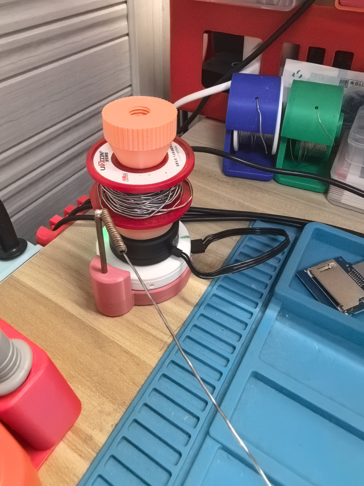

## 效果
手放开锡丝，3秒后，自动回收，会记录使用前的位置，自动恢复到之前的位置

<video width="540" height="960" controls>
  <source src="res/ok.mp4" type="video/mp4">
  您的浏览器不支持视频播放。
</video>

## 3D模型分享

https://makerworld.com.cn/zh/models/2923318-zi-dong-xi-si-jia#profileId-3427451

## PCB分享

https://oshwhub.com/w123l123h/project_eunshpgr

## 注意事项

* 代码中电机**零电角度**是写死的，请根据自己的电机设置
  * Foc::offset设置
  * 如果不知道这个参数是多少，修改代码，调用Foc::updateOffset获取，入参含义是Vq用3或者4都可以
  * 也可以使用SimpleFoc库获取zero_electric_angle